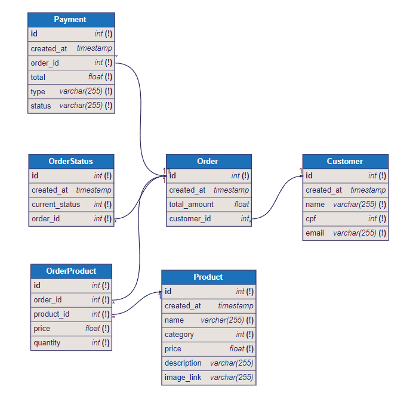

# 📊 Documentação do Banco de Dados - TC FIAP

## 1. Introdução

Este documento apresenta a documentação completa do banco de dados do sistema TC FIAP, uma solução para gestão de restaurantes que controla pedidos, produtos, clientes e pagamentos. O banco de dados foi projetado seguindo os princípios da Clean Architecture e otimizado com índices para melhor performance.

### Tecnologias Utilizadas
- **PostgreSQL 15**: Sistema de gerenciamento de banco de dados relacional
- **GORM**: ORM para Go com suporte a migrações automáticas
- **Docker**: Containerização do banco de dados
- **Kubernetes**: Orquestração em ambiente de produção

## 2. Estrutura do Banco de Dados

O banco de dados é composto por 5 tabelas principais que representam as entidades do domínio:

### 2.1 Tabela `customer`
Armazena informações dos clientes do restaurante.

| Campo | Tipo | Descrição | Restrições |
|-------|------|-----------|------------|
| `id` | SERIAL | Identificador único do cliente | PRIMARY KEY |
| `created_at` | TIMESTAMP | Data/hora de criação do registro | DEFAULT current_timestamp |
| `name` | VARCHAR(255) | Nome completo do cliente | NOT NULL |
| `cpf` | INTEGER | CPF do cliente | NOT NULL, UNIQUE |
| `email` | VARCHAR(255) | Email do cliente | NOT NULL |

**Índices:**
- `idx_customer_cpf` (UNIQUE): Otimiza consultas por CPF e garante unicidade

### 2.2 Tabela `product`
Contém o catálogo de produtos disponíveis no restaurante.

| Campo | Tipo | Descrição | Restrições |
|-------|------|-----------|------------|
| `id` | SERIAL | Identificador único do produto | PRIMARY KEY |
| `created_at` | TIMESTAMP | Data/hora de criação do registro | DEFAULT current_timestamp |
| `name` | VARCHAR(255) | Nome do produto | NOT NULL |
| `category` | INTEGER | Categoria do produto (1-4) | NOT NULL |
| `price` | FLOAT | Preço do produto | NOT NULL |
| `description` | VARCHAR(255) | Descrição do produto | - |
| `image_link` | VARCHAR(255) | URL da imagem do produto | - |

**Categorias:**
- 1: Lanche
- 2: Acompanhamento  
- 3: Bebida
- 4: Sobremesa

### 2.3 Tabela `order`
Registra os pedidos realizados pelos clientes.

| Campo | Tipo | Descrição | Restrições |
|-------|------|-----------|------------|
| `id` | SERIAL | Identificador único do pedido | PRIMARY KEY |
| `created_at` | TIMESTAMP | Data/hora de criação do pedido | DEFAULT current_timestamp |
| `total_amount` | FLOAT | Valor total do pedido | DEFAULT 0 |
| `customer_id` | INTEGER | Referência ao cliente (opcional) | FK → customer.id |

**Índices:**
- `idx_order_customer_id`: Otimiza consultas de pedidos por cliente

### 2.4 Tabela `order_product`
Tabela associativa entre pedidos e produtos (relacionamento N:M).

| Campo | Tipo | Descrição | Restrições |
|-------|------|-----------|------------|
| `id` | SERIAL | Identificador único do registro | PRIMARY KEY |
| `order_id` | INTEGER | Referência ao pedido | NOT NULL, FK → order.id |
| `product_id` | INTEGER | Referência ao produto | NOT NULL, FK → product.id |
| `price` | FLOAT | Preço do produto no momento do pedido | NOT NULL |
| `quantity` | INTEGER | Quantidade do produto no pedido | NOT NULL |

**Índices:**
- `idx_order_product_order_id`: Otimiza consultas de produtos por pedido
- `idx_order_product_product_id`: Otimiza consultas de pedidos por produto

### 2.5 Tabela `order_status`
Controla o histórico de status dos pedidos.

| Campo | Tipo | Descrição | Restrições |
|-------|------|-----------|------------|
| `id` | SERIAL | Identificador único do status | PRIMARY KEY |
| `created_at` | TIMESTAMP | Data/hora da mudança de status | DEFAULT current_timestamp |
| `current_status` | INTEGER | Status atual do pedido (1-4) | NOT NULL |
| `order_id` | INTEGER | Referência ao pedido | NOT NULL, FK → order.id |

**Status possíveis:**
- 1: Recebido
- 2: Em preparação
- 3: Pronto
- 4: Finalizado

**Índices:**
- `idx_order_status_order_id`: Otimiza consultas de status por pedido

### 2.6 Tabela `payment`
Registra os pagamentos dos pedidos.

| Campo | Tipo | Descrição | Restrições |
|-------|------|-----------|------------|
| `id` | SERIAL | Identificador único do pagamento | PRIMARY KEY |
| `created_at` | TIMESTAMP | Data/hora de criação do pagamento | DEFAULT current_timestamp |
| `order_id` | INTEGER | Referência ao pedido | NOT NULL, FK → order.id |
| `total` | FLOAT | Valor do pagamento | NOT NULL |
| `type` | VARCHAR(255) | Tipo de pagamento | NOT NULL |
| `status` | VARCHAR(255) | Status do pagamento | NOT NULL |

**Índices:**
- `idx_payment_order_id`: Otimiza consultas de pagamento por pedido

## 3. Diagrama Entidade-Relacionamento (ERD)



O diagrama acima ilustra as relações entre as entidades do banco de dados:

- **Customer** ← (1:N) → **Order**: Um cliente pode ter vários pedidos
- **Order** ← (1:N) → **OrderProduct**: Um pedido pode ter vários produtos
- **Product** ← (1:N) → **OrderProduct**: Um produto pode estar em vários pedidos
- **Order** ← (1:N) → **OrderStatus**: Um pedido tem histórico de status
- **Order** ← (1:1) → **Payment**: Um pedido tem um pagamento associado

## 4. Otimizações e Performance

### 4.1 Índices Implementados

O banco de dados foi otimizado com índices estratégicos para melhorar a performance das consultas mais frequentes:

| Índice | Tabela | Campo(s) | Tipo | Propósito |
|--------|--------|----------|------|-----------|
| `idx_customer_cpf` | customer | cpf | UNIQUE | Busca rápida por CPF e garantia de unicidade |
| `idx_order_customer_id` | order | customer_id | REGULAR | Consultas de pedidos por cliente |
| `idx_order_product_order_id` | order_product | order_id | REGULAR | Produtos de um pedido específico |
| `idx_order_product_product_id` | order_product | product_id | REGULAR | Pedidos que contêm um produto |
| `idx_order_status_order_id` | order_status | order_id | REGULAR | Histórico de status de um pedido |
| `idx_payment_order_id` | payment | order_id | REGULAR | Pagamento de um pedido específico |

### 4.2 Benefícios dos Índices

1. **Consultas por CPF**: Busca de clientes otimizada de O(n) para O(log n)
2. **Joins entre tabelas**: Melhora significativa na performance de consultas com JOIN
3. **Filtros por chave estrangeira**: Acesso rápido a registros relacionados
4. **Ordenação**: Consultas ordenadas executam mais rapidamente

### 4.3 Estratégias de Performance

- **Índices em chaves estrangeiras**: Todos os campos de relacionamento possuem índices
- **Validação de unicidade**: CPF único garante integridade dos dados
- **Paginação**: Suporte a consultas paginadas para grandes volumes
- **Preload otimizado**: GORM configurado para carregar relacionamentos eficientemente

### 4.4 Monitoramento e Manutenção

Para manter a performance do banco:

```sql
-- Verificar uso dos índices
SELECT schemaname, tablename, indexname, idx_tup_read, idx_tup_fetch 
FROM pg_stat_user_indexes;

-- Analisar performance de consultas
EXPLAIN ANALYZE SELECT * FROM customer WHERE cpf = 12345678901;

-- Estatísticas das tabelas
SELECT schemaname, tablename, n_tup_ins, n_tup_upd, n_tup_del 
FROM pg_stat_user_tables;
```

## Conclusão

O banco de dados do TC FIAP foi projetado com foco na performance, integridade e escalabilidade. A implementação de índices estratégicos garante que as operações mais comuns sejam executadas de forma eficiente, enquanto a estrutura normalizada mantém a consistência dos dados.

As otimizações implementadas proporcionam:
- ✅ Consultas rápidas por CPF de cliente
- ✅ Joins eficientes entre pedidos e produtos  
- ✅ Acesso otimizado ao histórico de status
- ✅ Performance consistente com o crescimento dos dados
- ✅ Integridade referencial garantida

---

*Documentação gerada em: Setembro 2025*  
*Versão do banco: PostgreSQL 15*  
*ORM: GORM para Go*
